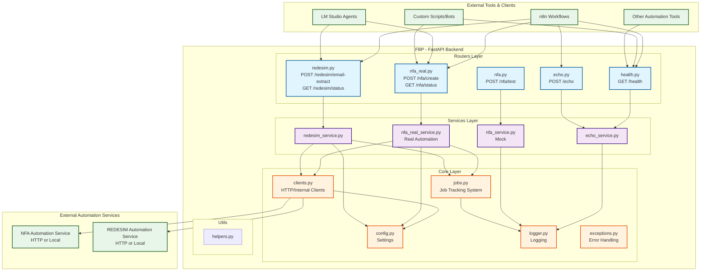
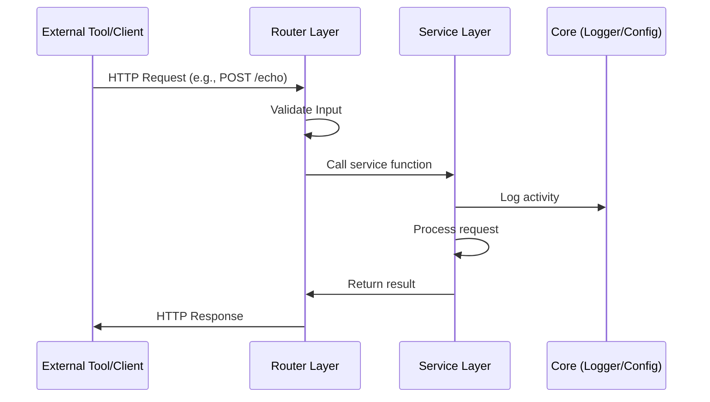
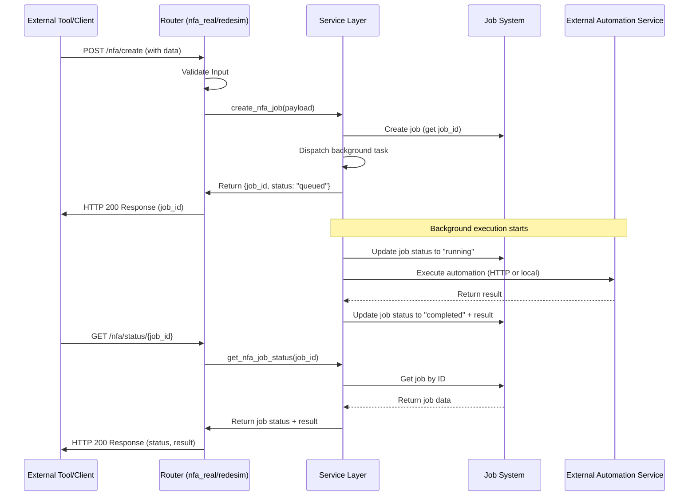
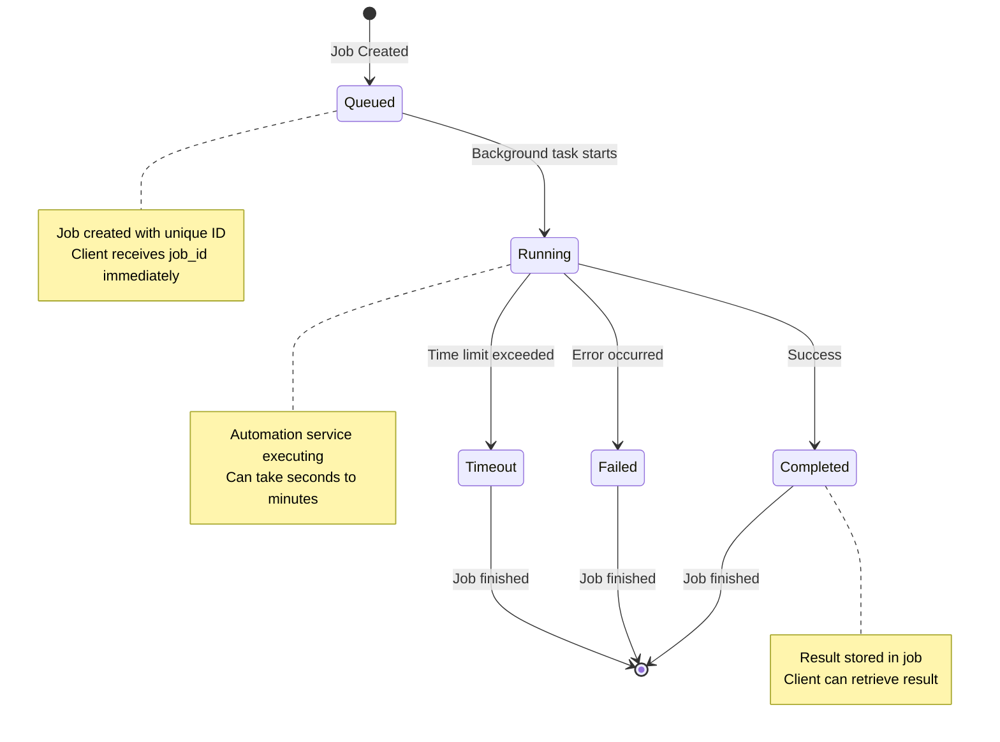
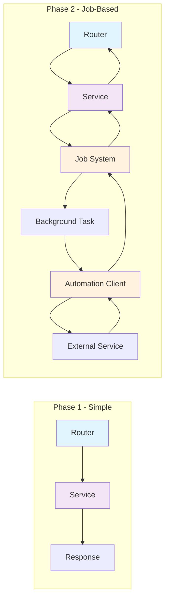
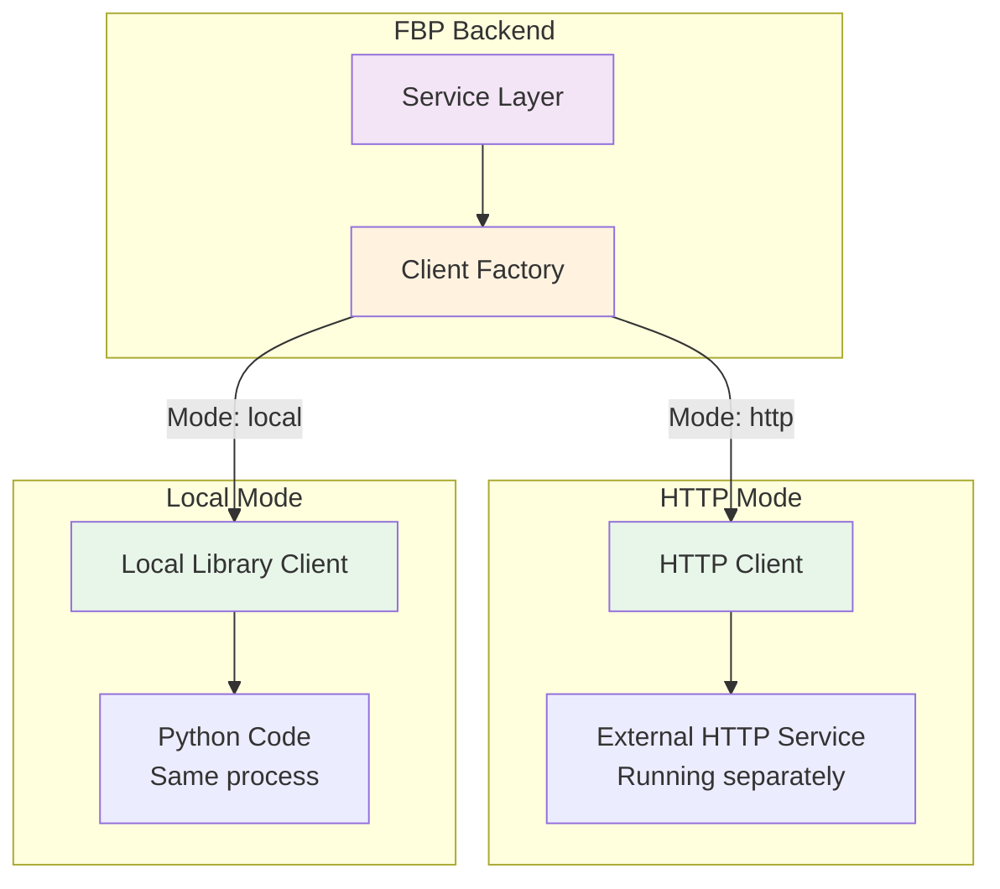
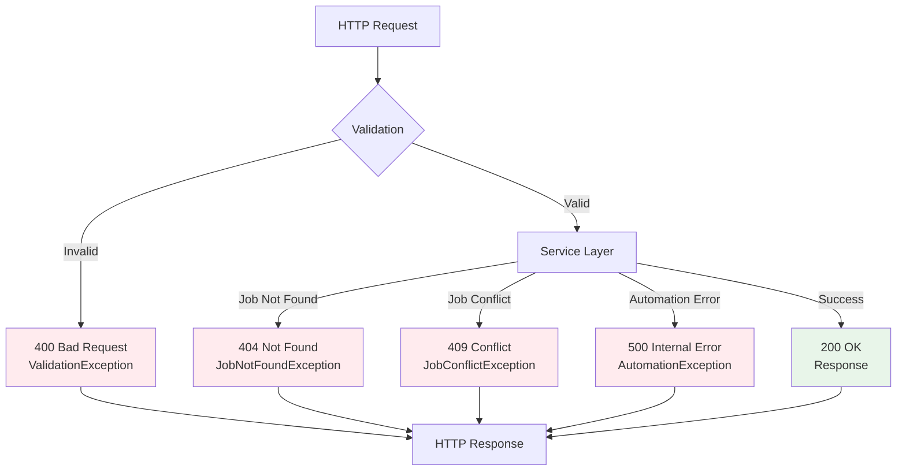

# FBP Architecture Diagram

This document contains Mermaid diagrams visualizing the FBP project structure and data flow.

## System Overview

## Request Flow - Phase 1 (Simple Endpoints)

## Request Flow - Phase 2 (Job-Based Automation)

## Job Lifecycle

## Component Relationships

## Integration Modes

## Error Handling Flow

## File Structure Overview

```mermaid
graph TD
    Root[FBP Project Root] --> App[app/]
    Root --> Tests[tests/]
    Root --> Docs[docs/]
    Root --> Config[Config Files]

    App --> Main[main.py<br/>FastAPI App]
    App --> Routers[routers/]
    App --> Services[services/]
    App --> Core[core/]
    App --> Utils[utils/]

    Routers --> R1[health.py]
    Routers --> R2[echo.py]
    Routers --> R3[nfa.py]
    Routers --> R4[nfa_real.py]
    Routers --> R5[redesim.py]

    Services --> S1[echo_service.py]
    Services --> S2[nfa_service.py]
    Services --> S3[nfa_real_service.py]
    Services --> S4[redesim_service.py]

    Core --> C1[config.py]
    Core --> C2[logger.py]
    Core --> C3[exceptions.py]
    Core --> C4[jobs.py]
    Core --> C5[clients.py]
    Core --> C6[browser.py]

    Tests --> T1[test_health.py]
    Tests --> T2[test_echo.py]
    Tests --> T3[test_nfa.py]
    Tests --> T4[test_nfa_real.py]
    Tests --> T5[test_redesim.py]

    Config --> CF1[pyproject.toml]
    Config --> CF2[requirements.txt]
    Config --> CF3[.env]
    Config --> CF4[run.sh]

    style App fill:#e1f5ff
    style Routers fill:#e1f5ff
    style Services fill:#f3e5f5
    style Core fill:#fff3e0
    style Tests fill:#e8f5e9
```

